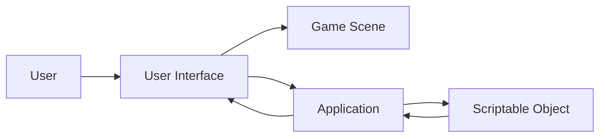

## 📋 Sheen Unity Game Kit
This is a simple hyper-casual runner game development kit.

This game kit consists of 3 parts:
-   First part (Input Controller), aims to produce a less detailed input controller with a clean interface and easy to use.
-   Second Part (Character Controller), creates a character by choosing from previously created objects with human bone structure and dressing that object.
-   Third part similar to Forever, Forever is a level designer that allows to arrange game objects created by the user in a regular or random order. Our Game Kit aims for almost the same thing but with an easier to use and understandable system.
  

## 🛠 Architecture

The project consists of three layers: data layer, business layer and presentation layer. The data is kept on the Scriptable Object, which is a Unity object. The place where this data is processed is the business layer and includes system components. The component where the results are displayed to the end user is the presentation layer.
  

## 🖼 Project Video
https://user-images.githubusercontent.com/61520877/178058101-372fdc60-6eaa-4d9b-8681-e527f16e86fb.mp4

